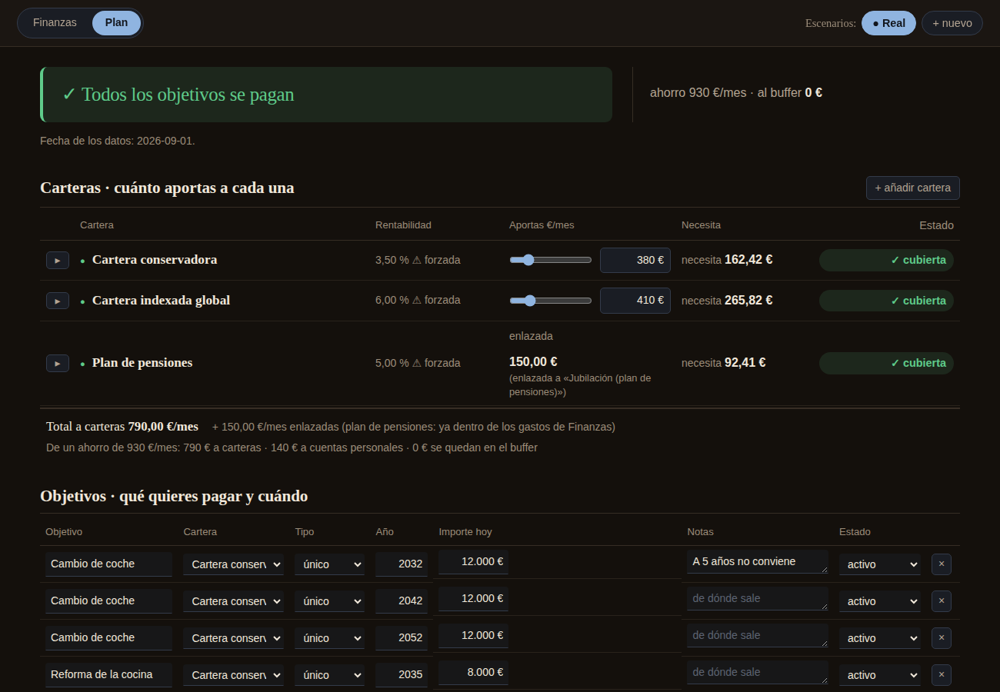
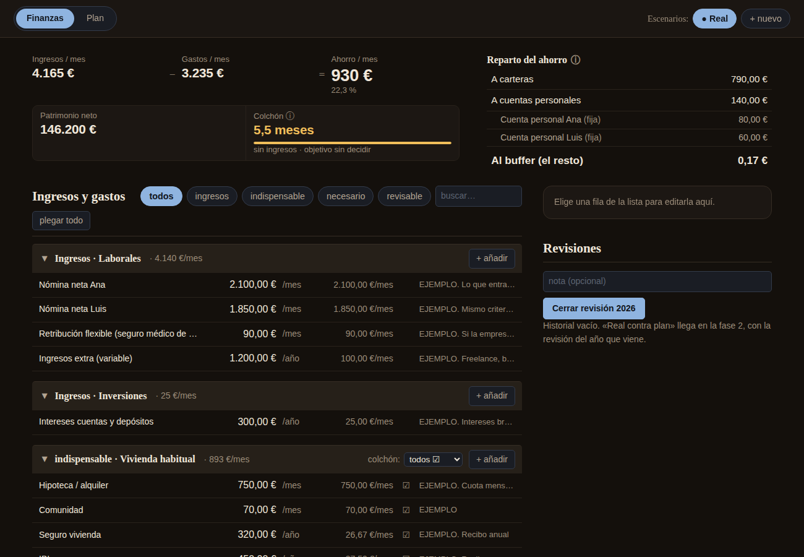

# finanzas-app

**Tus finanzas familiares y tu plan de futuro, en dos pantallas.**

Apuntas lo que entra, lo que sale y lo que tienes. Dices qué quieres conseguir (un coche en 2032, la
universidad de tus hijos, completar la jubilación) y la app te contesta, en euros, a la pregunta que
importa: **¿llegas?** Y si no llegas, te dice qué objetivo falla, cuándo y cuánto te falta al mes.


<sub>Vídeo en mejor calidad: [docs/tutorial.mp4](docs/tutorial.mp4). Todos los datos son de una familia inventada.</sub>

> **No es asesoramiento financiero.** Es una calculadora: hace las cuentas con los supuestos que tú pones
> (rentabilidades, inflación, impuestos). Las decisiones son tuyas.

---

## Qué puedes hacer

**Plan** — la pregunta de siempre, contestada con números.
- Un veredicto claro: *✓ Todos los objetivos se pagan* o *⚠ No llegas: el coche de 2032*.
- Tus carteras (conservadora para lo cercano, indexada para lo lejano, plan de pensiones…) con lo que aportas
  y lo que **necesitarías** aportar para cumplir sus objetivos.
- Una proyección año a año, con inflación e impuestos (tramos reales del IRPF del ahorro o un tipo fijo).

**Finanzas** — tu foto de hoy.
- Ingresos, gastos y ahorro al mes, agrupados como tú quieras.
- Patrimonio neto y reparto del ahorro: cuánto va a cada cartera y a cada cuenta.
- El **colchón**: cuántos meses aguantaríais sin ingresos, y con paro.

**Escenarios** — jugar sin romper nada.
- «¿Y si me compro una moto?», «¿y si aporto 100 € menos?». Cualquier cambio va a un escenario: ves el efecto
  al instante, lo comparas con lo real y decides si aplicarlo o descartarlo. **Lo real no se toca hasta que tú
  lo dices.**

| Plan | Finanzas |
|---|---|
|  |  |

## Pruébalo en 2 minutos

Necesitas [Node.js](https://nodejs.org/) 22.12 o superior y git.

```bash
git clone https://github.com/rsotor/finanzas-app.git
cd finanzas-app
npm install
npm run demo
```

Abre <http://127.0.0.1:3000> y juega con la familia de ejemplo (Ana, Luis y Leo).

¿Te convence? **`npm run empezar`** arranca con tu propia base de datos, vacía, que se guarda solo en tu
ordenador. La guía completa (Windows, Mac, Linux, Docker, problemas frecuentes) está en
**[docs/instalacion.md](docs/instalacion.md)**.

## Tus datos son tuyos

- La app corre **en tu ordenador**. No hay nube, cuentas ni servidores de terceros.
- Sin login, así que solo escucha en `127.0.0.1`: nadie de tu red puede entrar.
- Tus datos viven en un fichero (`webapp/server/datos/finanzas.sqlite`) que **nunca se sube a git**, ni
  siquiera si haces un fork. Haz copia de seguridad de ese fichero y listo.

## ¿Prefieres una hoja de cálculo?

En [`plantilla-excel/`](plantilla-excel/) tienes la misma idea en un Excel (pensado para Excel y Google Sheets;
las fórmulas se verifican con LibreOffice), con la familia de ejemplo y una pestaña «Léeme» que explica cómo rellenarlo. Es más limitada que la app, pero
no hay que instalar nada.

## Para usuarios de Claude Code

El repo incluye un **consultor financiero independiente** en forma de comandos de
[Claude Code](https://docs.claude.com/en/docs/claude-code/overview): `/consultor` y sus subcomandos para evaluar
un fondo, comparar productos, revisar lo que te propone un asesor, preparar una reunión o montar tu plan, más un
análisis multi-agente (costes, fiscal, riesgo y estrategia). Regla de la casa: **cero invenciones**; lo que no
sabe, lo dice.

Se configura copiando `input/situation.example.md` a `input/situation.md` (que no se sube) y rellenándolo con
tu situación. Detalles en [CLAUDE.md](CLAUDE.md).

## Colabora

¿Te has atascado instalando? ¿Echas algo en falta? ¿Un cálculo no te cuadra?
[Abre una issue](../../issues/new/choose): hay plantillas para cada caso. **Nunca pegues datos financieros
reales**: reprodúcelo con la demo. Si quieres proponer cambios de código, lee [CONTRIBUTING.md](CONTRIBUTING.md).

## Cómo está hecho

| Parte | Qué es |
|---|---|
| `app/` | El motor: cálculos deterministas en JavaScript que corren igual en el navegador y en el servidor, con más de 150 tests. |
| `webapp/server/` | API y base de datos SQLite (Node + Express). |
| `webapp/web/` | La interfaz (React + Vite). |
| `plantilla-excel/` | La plantilla Excel y los datos de ejemplo. Un test garantiza que el motor da **los mismos números** que el Excel, al céntimo. |
| `.claude/`, `agents/` | Los comandos y agentes de Claude Code. |

`npm test` pasa los tests del motor y del servidor; `npm run test:web`, los de la interfaz.

## Licencia

[MIT](LICENSE). Úsalo, cámbialo y compártelo.
